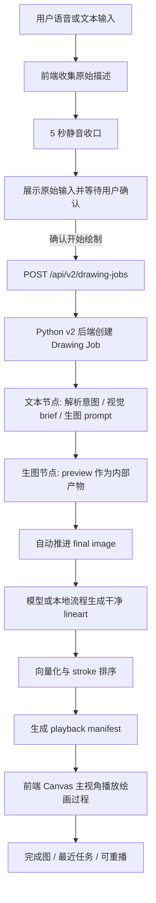
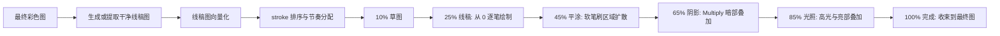
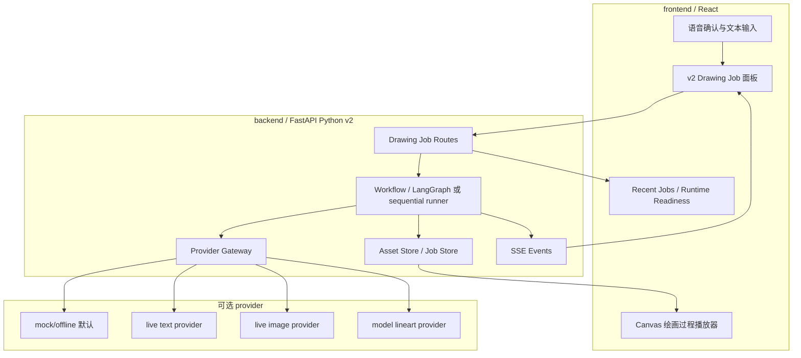

# VocaSketch

中文 | [English](README.en.md)

VocaSketch 是一款面向比赛 demo 的 AI 语音绘图工作台。用户通过中文语音描述创作意图，系统将自然语言拆解为可执行绘图操作，并生成可分层、可编辑、可回放的二次元水彩头像绘图工程。

本项目选择七牛云 XEngineer 题目二：AI 语音绘图工具。

## 赛题方向

- 题目：AI 语音绘图工具
- 核心要求：用户不能依赖鼠标或键盘完成核心绘图创作流程，需要通过语音指令完成绘图
- 重点考察：
  - 语音指令理解准确性
  - 对模糊或识别错误指令的容错能力
  - 从语音到绘图操作的响应延迟
  - 复杂指令的拆解与执行能力
  - 设计文档中对计划能力、最终实现能力、未完成原因的记录

## 产品定位

VocaSketch 不是单纯的一键 AI 生图工具，而是一个语音驱动的数位绘画工作台。

当前主线是 Python v2 drawing job：用户通过语音或文本描述画面，系统在用户确认后启动绘图任务。后端可以在显式 live 配置下调用真实文本/生图/线稿模型，也可以默认走本地 mock/offline 路径。最终彩色图会被转成干净线稿和可播放的 stroke manifest，前端主视角用 Canvas 展示从草图、线稿、平涂、阴影、光照到完成图的绘画过程，而不是只展示一张结果图。

## MVP 范围

MVP 聚焦一个可控主题：

- 二次元半身头像
- 水彩上色
- 素描线稿
- 语义图层
- 语音创建、确认、修改、暂停、继续、撤销、重做和回放

当前不把任意主题自由绘画、复杂人体姿态、多语言控制、登录系统或端到端生图作为 MVP 主目标。

## 计划能力

### P0 必做

- 中文语音输入
- AI 语音或字幕反馈
- 绘图指令理解
- 执行前复述确认
- 自动完整绘画模式
- 半身二次元头像生成
- 支持通过语音指定男生、女生或中性角色
- 水彩上色 + 素描线稿主风格
- 连续语音修改
- 暂停和继续
- 撤销和重做
- 语义图层面板
- 简化对象数量展示
- 后端保存作品工程和操作历史

### P1 增强

- 轻量回放绘画过程
- 导出图片
- 分阶段绘画模式
- 局部重画
- 作品恢复
- 完整 demo 流程说明

## 仓库结构

```text
.
├── backend/                  # Python v2 后端：drawing jobs、资产、provider、SSE
├── docs/                        # PRD、设计文档、架构说明、启动说明
├── frontend/                    # 前端绘图工作台
├── .github/                     # PR 模板
├── AGENTS.md                    # 仓库协作与 Git 操作规则
├── .env.example                 # 环境变量示例
├── .gitignore
├── competition-requirements.md  # 比赛工程规范与提交要求
├── README.en.md                 # 英文 README
└── README.md                    # 中文 README
```

## 当前实现状态

当前仓库已经切换为 Python-first v2 后端。前端可以本地启动，用于演示语音入口、用户确认、Python drawing job、绘画过程播放、最近任务、运行时状态摘要、图层面板和本地 Canvas 辅助视图。后端提供 v2 drawing jobs、资产内容、runtime readiness、recent jobs、SSE 事件流、统一错误 envelope、取消/重试语义和可选真实 provider 边界。

默认 profile 仍是 mock/offline，不会默认发起真实外部模型请求。真实 provider 只有在显式配置 live 环境变量、API key、base URL 和模型名称后才会启用。

已包含：

- 项目 README
- 英文 README
- 启动说明
- 设计文档
- 架构说明
- API 合约
- PR 模板
- 环境变量示例
- 比赛规范 checklist
- PRD 文档
- 前端 Vite + React 工作台原型
- Python FastAPI v2 后端
- Drawing Job / SSE / 本地资产文件层
- 可选真实文本、生图与模型线稿 provider 边界
- recent jobs、runtime readiness、刷新恢复与断线续跟踪
- 统一 API 错误 envelope、失败事件脱敏、取消/重试/超时一致性
- 绘画过程播放 manifest、线稿向量化和 Canvas 逐笔回放
- 仓库协作与 Git 操作规则

暂未包含：

- 生产级账号体系
- 真实图层分解 provider 的生产接入

## 当前主流程



## 绘画过程链路



## 运行时架构



## 启动说明

前端工作台当前可以本地启动：

```bash
cd frontend
npm install
npm run dev
```

默认开发地址：

```text
http://localhost:3000
```

Python v2 后端当前可以本地启动：

```bash
cd backend
python -m uvicorn vocasketch_backend.main:create_app --factory --app-dir src --host 127.0.0.1 --port 8000
```

默认开发地址：

```text
http://localhost:8000
```

runtime readiness：

```text
http://localhost:8000/api/v2/runtime/readiness
```

更多说明见 [docs/startup.md](docs/startup.md)。

## 文档入口

- [项目结构](docs/project-structure.md)
- [PRD](docs/PRD-ai-voice-drawing.md)
- [设计文档](docs/design.md)
- [架构说明](docs/architecture.md)
- [历史 API 合约归档](docs/archive/api-v1-contract.md)
- [启动说明](docs/startup.md)
- [比赛工程规范](competition-requirements.md)
- [English README](README.en.md)

## 开发规范

- 正式仓库需在赛题发布后创建。
- commit 时间戳需落在所选批次的开始与截止时间内。
- 使用小粒度 PR，避免一个 PR 混入多个目标。
- PR 描述需清楚说明功能、实现思路、测试方式和影响范围。
- 后续加入运行时代码后，主分支应保持可运行。
- 第三方依赖和原创功能需要在 README 或相关文档中说明。
- 核心 demo 流程必须以语音控制为主。

## 项目命名

VocaSketch 由 vocal 和 sketch 组合而来，表达“用声音驱动绘图草图与水彩创作”的产品方向。
