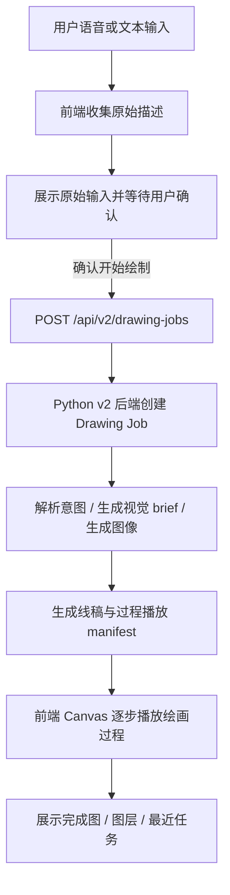
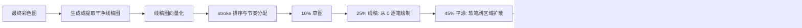
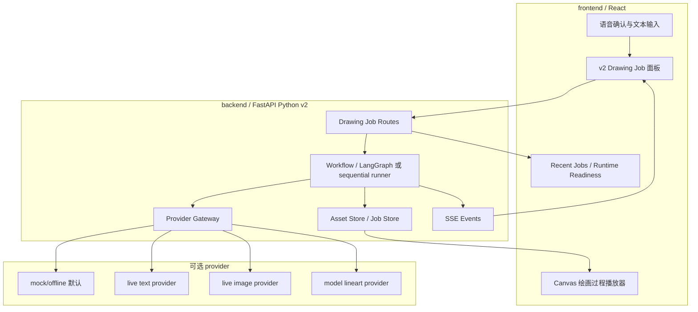

# VocaSketch

中文 | [English](README.en.md)

VocaSketch 是一款面向七牛云 XEngineer 题目二的 AI 语音绘图工作台。用户主要通过中文语音描述创作意图，系统在执行前先复述确认，再把自然语言拆解为可执行绘图操作，最终生成一个可分层、可回放、可解释的二次元水彩头像绘图工程，而不是只返回一张端到端生成图片。

## 参赛信息

- 赛事：七牛云 XEngineer 暑期实训营
- 赛题：题目二，AI 语音绘图工具
- 参赛形式：个人参赛
- 仓库地址：[ZIFeIYUuuuuuu/VocaSketch](https://github.com/ZIFeIYUuuuuuu/VocaSketch)
- Demo 视频：[七牛云×XEngineer暑期实训营-2026-批次4-赛题2](https://www.bilibili.com/video/BV13LJP67EJ3/?share_source=copy_web&vd_source=105a7431714c59e38e2598fd37497aa9)

## 评审入口

- 一句话概览：语音驱动的 AI 绘图工作台
- 仓库地址：[ZIFeIYUuuuuuu/VocaSketch](https://github.com/ZIFeIYUuuuuuu/VocaSketch)
- Demo 视频：[七牛云×XEngineer暑期实训营-2026-批次4-赛题2](https://www.bilibili.com/video/BV13LJP67EJ3/?share_source=copy_web&vd_source=105a7431714c59e38e2598fd37497aa9)
- 快速启动：见下方“本地启动方式”
- 架构说明：[docs/architecture.md](docs/architecture.md)
- 项目结构：[docs/project-structure.md](docs/project-structure.md)
- 开发与启动：[docs/startup.md](docs/startup.md)

## 项目简介

本项目聚焦比赛最核心的问题：在不依赖鼠标和键盘完成主要创作流程的前提下，让用户通过语音完成创建、确认、修改、暂停、继续和回放等操作。

VocaSketch 的产品定位不是“一键 AI 生图”，而是“语音驱动的数位绘画工作台”：

- 用户用中文语音描述画面
- 系统先复述理解结果，降低误识别风险
- 用户确认后启动绘制
- 后端生成结构化绘图任务与过程资产
- 前端以图层、过程播放和完成图的形式展示结果

## 设计思考

我一开始其实想做的是很直观的前端 Canvas 绘制：用线条、笔刷和动画去模拟“正在画画”的感觉。但真正做下来后发现，仅靠自然语言驱动前端去拼动画，最终效果往往不够稳定，也很难让用户相信这不是一张普通的 AI 生图。

所以我把思路往前推进了一步：既然已经要用大模型，就不能只把它当成“出图器”，而要让它先理解用户意图，再把结果拆成更接近人类数位板绘画的阶段。于是整个流程改成了先打草稿，再出线稿，再平涂，随后补阴影、光照和最后微调，让用户看到的是一条完整的绘画过程，而不是一张突然生成的成品图。

这也是 VocaSketch 和传统“一键生图”最大的不同。

## 核心亮点

- 语音优先：核心创作流程以中文语音控制为主，符合赛题方向
- 执行前确认：系统先复述理解结果，再进入绘制，降低误执行
- 过程可验证：支持绘画过程播放，证明不是一次性图片生成
- 工程可解释：结果包含图层、任务历史和播放 manifest，而不是单张黑盒图片
- 可切换运行模式：默认 mock/offline 可本地稳定演示，显式配置后可切换到真实 provider

## 功能列表

### P0 已实现主线

- 中文语音输入
- 文本/语音确认链路
- 绘图指令理解
- 执行前复述确认
- 自动完整绘图流程
- 二次元半身头像生成
- 水彩上色 + 素描线稿主风格
- 最近任务展示
- 语义图层展示
- 运行时状态摘要
- 绘画过程逐步播放
- 本地资产与任务历史持久化

### P1 当前已覆盖或部分覆盖

- 轻量回放绘画过程
- 刷新后恢复最近任务
- mock/offline 与 live provider 边界切换
- 绘制失败事件脱敏与统一错误 envelope

### 暂未完成

- 生产级账号体系
- 生产可用的真实图层分解 provider
- 面向任意主题的自由绘画
- 全身角色和复杂姿态
- 稳定的线上部署版本

## 赛题匹配说明

本项目针对题目二“AI 语音绘图工具”做了明确约束：

- 核心创作流程不以鼠标/键盘为主，而以语音输入和语音确认驱动
- 强调语音理解准确性、模糊指令容错和复杂指令拆解
- 用图层、过程播放和任务历史证明结果不是黑盒生图
- 保留设计文档、架构说明、PRD 和开发记录，便于评委复现和审查

## Demo 视频

- Demo 视频链接：[七牛云×XEngineer暑期实训营-2026-批次4-赛题2](https://www.bilibili.com/video/BV13LJP67EJ3/?share_source=copy_web&vd_source=105a7431714c59e38e2598fd37497aa9)
- 建议视频内容：
  - 1. 一句话创建角色
  - 2. 系统复述并等待确认
  - 3. 开始绘制并展示过程播放
  - 4. 展示图层面板、最近任务和完成图
  - 5. 追加一次修改指令或暂停/继续操作

## Demo 演示主流程



## 绘画过程链路



## 前后端运行时架构



## 技术栈

### 前端

- React 19
- TypeScript
- Vite
- Canvas 2D
- Web Speech API（浏览器语音输入）

### 后端

- Python 3.11+
- FastAPI
- Uvicorn
- Pydantic
- 可选 LangGraph runner

### 工程与文档

- GitHub
- Pull Request 工作流
- Mermaid 文档图

## 第三方依赖列表

### 前端主要依赖

- `react`
- `react-dom`
- `vite`
- `@vitejs/plugin-react`
- `@tailwindcss/vite`
- `tailwindcss`
- `lucide-react`
- `typescript`

### 后端主要依赖

- `fastapi`
- `uvicorn`
- `pydantic`
- `langgraph`（可选）

### 外部能力边界

- 浏览器 `Web Speech API`：用于语音转文本入口
- OpenAI-compatible Text/Image API：用于真实 provider 模式下的文本理解与图像生成

## 原创功能说明

以下内容为本项目围绕赛题目标自行设计与实现的原创部分：

- 语音优先的绘图工作台交互方案
- “先复述确认，再执行绘制”的比赛型语音交互链路
- Python-first v2 Drawing Job 架构
- drawing job、recent jobs、runtime readiness、SSE 事件流
- 从最终图回推可解释绘画过程的 playback manifest 生成链路
- 前端 Canvas 逐笔播放视图
- mock/offline 演示模式与 live provider 显式启用边界
- 面向“二次元半身头像 + 水彩素描风”的受控绘图流程设计

## 项目目录结构

```text
.
├── backend/                  # Python v2 后端：drawing jobs、资产、provider、SSE
├── docs/                     # PRD、设计文档、架构说明、启动说明
├── frontend/                 # 前端绘图工作台
├── .github/                  # PR 模板
├── AGENTS.md                 # 仓库协作与 Git 操作规则
├── .env.example              # 环境变量示例
├── competition-requirements.md
├── README.md
└── README.en.md
```

## 核心模块说明

- `frontend/src/App.tsx`
  - 整体工作台入口，组织语音输入、任务提交和主视图状态
- `frontend/src/components/ProcessPlaybackPlayer.tsx`
  - 绘画过程播放器，负责按阶段和节奏回放过程
- `frontend/src/components/LayerPanel.tsx`
  - 图层与语义结构展示
- `backend/src/vocasketch_backend/routes/drawing_jobs.py`
  - v2 drawing jobs 接口入口
- `backend/src/vocasketch_backend/workflows/drawing_graph.py`
  - 绘图任务运行图与过程编排
- `backend/src/vocasketch_backend/providers/`
  - mock/live provider 网关和派生播放能力
- `backend/src/vocasketch_backend/assets/asset_store.py`
  - 任务资产与内容文件管理

## 本地启动方式

### 前端

```bash
cd frontend
npm install
npm run dev
```

默认地址：

```text
http://localhost:3000
```

### 后端

```bash
cd backend
python -m uvicorn vocasketch_backend.main:app --app-dir src --host 127.0.0.1 --port 8000
```

默认地址：

```text
http://localhost:8000
```

runtime readiness：

```text
http://localhost:8000/api/v2/runtime/readiness
```

更多说明见 [docs/startup.md](docs/startup.md)。

## 环境变量说明

### 前端示例

见 [frontend/.env.example](frontend/.env.example)。

```text
VITE_API_V2_BASE_URL=http://localhost:8000/api/v2
VITE_ENABLE_V2_VOICE_DRAWING=true
```

### 后端常用配置

```text
VOCASKETCH_BACKEND_DATA_DIR=backend/data
VOCASKETCH_BACKEND_HOST=127.0.0.1
VOCASKETCH_BACKEND_PORT=8000
VOCASKETCH_PROVIDER_PROFILE=mock
VOCASKETCH_PROVIDER_ALLOW_LIVE_REQUESTS=0
VOCASKETCH_OPENAI_API_BASE_URL=
VOCASKETCH_OPENAI_API_KEY=
VOCASKETCH_OPENAI_RESPONSE_MODEL=
VOCASKETCH_OPENAI_IMAGE_API_BASE_URL=
VOCASKETCH_OPENAI_IMAGE_API_KEY=
VOCASKETCH_OPENAI_IMAGE_MODEL=
```

说明：

- 默认 `mock` 模式不联网，更适合本地稳定演示
- 只有显式设置 `VOCASKETCH_PROVIDER_ALLOW_LIVE_REQUESTS=1` 且 provider 配置完整时，才会调用真实模型
- 不要提交真实 API Key

## 验证方式

### 前端

```bash
cd frontend
npm run lint
```

### 后端

```bash
python -B -m compileall backend/src backend/tests
python -B -m unittest discover -s backend/tests -v
```

## 当前实现状态

当前仓库已经切换到 Python-first v2 主线。前端负责语音入口、确认交互、任务提交、过程播放与图层展示；后端负责任务编排、资产存储、provider 边界、事件流和运行时状态摘要。

默认主线适合比赛 demo：

- 本地可跑
- 不依赖必须联网的真实 provider
- 可以稳定展示“语音 -> 确认 -> 绘制 -> 回放 -> 完成图”的完整链路

## 已知问题与限制

- 当前最稳定的演示路径是 mock/offline，不是全链路真实商用 AI 绘图
- 绘图主题被限制在“二次元半身头像 + 水彩素描风”这一受控范围
- 浏览器语音能力依赖本地环境和麦克风权限，现场演示前需要提前检查
- 真实 provider 模式受 API 配置、网络状态和模型输出稳定性影响
- 暂未提供公开线上部署地址，建议评审按 README 在本地复现

## 部署地址

- 暂无公开线上部署地址
- 当前建议评审方式：按 README 本地启动前后端进行复现

## 个人分工

| 成员 | 负责内容 |
| --- | --- |
| ZIFeIYUuuuuuu | 产品设计、前端工作台、后端 v2 架构、语音交互流程、文档、比赛材料整理 |

## 文档入口

- [项目结构](docs/project-structure.md)
- [PRD](docs/PRD-ai-voice-drawing.md)
- [设计文档](docs/design.md)
- [架构说明](docs/architecture.md)
- [启动说明](docs/startup.md)
- [历史 API 合约归档](docs/archive/api-v1-contract.md)
- [比赛工程规范](competition-requirements.md)

## 开发规范

- 正式仓库需在赛题发布后创建
- commit 时间戳需落在所选批次的开始与截止时间内
- 使用小粒度 PR，避免一个 PR 混入多个目标
- PR 描述需清楚说明功能、实现思路、测试方式和影响范围
- 主分支应保持可运行
- 第三方依赖和原创功能需在 README 或相关文档中说明
- 核心 demo 流程必须以语音控制为主

## 项目命名

VocaSketch 由 `vocal` 和 `sketch` 组合而来，表达“用声音驱动绘图草图与水彩创作”的产品方向。
